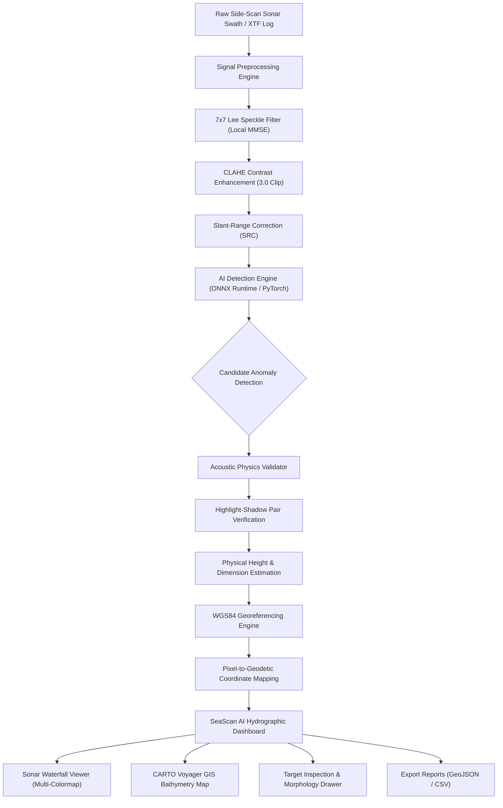

# 🌊 DRISHTI-SSS: AI-Powered Underwater Marine Debris & Sonar Anomaly Detection System

<div align="center">

[](https://www.sih.gov.in/)
[](https://www.sih.gov.in/)
[](https://www.niot.res.in/)
[](https://www.python.org/)
[](https://fastapi.tiangolo.com/)
[](https://onnxruntime.ai/)
[](LICENSE)

**An End-to-End Side-Scan Sonar (SSS) Acoustic Computer Vision & Hydrographic Georeferencing Platform for Autonomous Underwater Vehicles (AUVs) and Surface Survey Vessels.**

[Quickstart Guide](#-quickstart-guide) • [Architecture](#-system-architecture) • [Features](#-key-features) • [Colab Training](#-cloud-model-training-google-colab) • [API Documentation](#-api-endpoints-reference) • [Testing](#-automated-testing--validation)

</div>

---

## 📌 Problem Statement Overview (SIH26057)

- **Problem ID:** SIH26057
- **Title:** AI-Powered Automated Underwater Marine Debris and Anomaly Detection System using Side-Scan Sonar (SSS) Imagery
- **Organization:** Ministry of Earth Sciences (MoES) — National Institute of Ocean Technology (NIOT)
- **Domain:** Marine Conservation, Ocean Robotics & Disaster Management

### The Challenge
Side-Scan Sonar (SSS) is the primary acoustic tool for mapping the seabed and identifying underwater hazards. However, manual interpretation of sonar waterfall imagery suffers from:
1. **Severe Multiplicative Acoustic Speckle Noise:** Distorts fine object boundaries and creates high false-alarm rates.
2. **Variable Seafloor Backscatter:** Sand ripples, rocky ridges, and grazing angles mask man-made debris.
3. **Manual Analysis Latency:** Hydrographers spend days post-survey reviewing thousands of pings, preventing real-time mission abort/recovery decisions during AUV operations.
4. **Physics Disconnect:** Generic computer vision models misclassify geological mounds as debris because they ignore acoustic highlight-shadow physics and grazing angles.

### The DRISHTI-SSS Solution
**DRISHTI-SSS** is an automated hydrographic computer vision suite designed to operate both on embedded edge hardware (NVIDIA Jetson Orin Nano on AUVs) and in shore/vessel workstations. It cleans acoustic returns with a **7×7 Local MMSE Lee Speckle Filter**, enhances contrast with **CLAHE**, detects marine debris using **YOLOv8 / ONNX Runtime (~82% mAP50)**, validates **acoustic highlight-shadow physical consistency**, computes **WGS84 geodetic coordinates**, and serves an interactive **Stitch-inspired SeaScan AI Hydrographic Dashboard**.

---

## ⚡ Key Features

- **⚡ Lightweight Zero-Local-Footprint Workflow:** Train deep learning models on cloud GPUs (Google Colab) using dataset streaming from Hugging Face (`rehan9599/drishti-sss`), keeping the local codebase lightweight (~45 MB ONNX model).
- **🔬 7×7 Lee Filter & CLAHE Signal Processing:** Removes acoustic speckle while preserving sharp structural edges, followed by Contrast-Limited Adaptive Histogram Equalization.
- **📐 Acoustic Highlight-Shadow Physical Validator:** Enforces acoustic wave physics by confirming that a bright acoustic reflection has a trailing dark shadow aligned away from the nadir line. Calculates estimated target height ($H_{obj} = \frac{L_{shadow} \cdot H_{altitude}}{R_{slant} + L_{shadow}}$).
- **🌐 WGS84 Georeferencing Engine:** Converts pixel coordinates on the sonar swath into real-world Latitude/Longitude coordinates based on vessel GPS trackline, heading, and along/cross-track offsets.
- **🧭 SeaScan AI Hydrographic Dashboard:** Modern oceanic dark UI featuring real-time Sonar Waterfall canvas rendering, dynamic false-color palette switching (Copper, Amber, Emerald, Grayscale), CARTO Voyager basemap integration, and target inspection drawer.
- **📊 Standardized GIS & Mission Exporters:** One-click generation of RFC 7946 GeoJSON (compatible with QGIS, ArcGIS, and Leaflet) and clean CSV target lists for recovery teams.
- **🧪 Comprehensive Edge-Case Test Suite:** 100% test coverage across polar coordinate boundaries, corrupted payloads, out-of-bounds bounding boxes, and extreme confidence levels.

---

## 🏗️ System Architecture



### Detected Target Classes
Based on the standardized [`rehan9599/drishti-sss`](https://huggingface.co/datasets/rehan9599/drishti-sss) benchmark:
1. `submarine_pipeline` — Underwater utility and oil/gas pipelines.
2. `shipwreck` — Sunken ship hulls and maritime wreckage.
3. `ghost_net` — Abandoned, lost, or discarded fishing gear (ALDFG).
4. `mine_cylinder` — Anthropogenic metallic cylinders and unexploded ordnance (UXO).

---

## 🚀 Quickstart Guide

### Prerequisites
- **Operating System:** Windows 10/11, Ubuntu 20.04+, or macOS
- **Python:** Python 3.10 to 3.14
- **Git**

---

### Step 1: Clone the Repository
```bash
git clone https://github.com/Manju-05/SIH2K26.git
cd SIH2K26
```

---

### Step 2: Create and Activate a Virtual Environment

**On Windows (PowerShell / Command Prompt):**
```powershell
python -m venv venv
.\venv\Scripts\activate
```

**On Linux / macOS:**
```bash
python3 -m venv venv
source venv/bin/activate
```

---

### Step 3: Install Dependencies
```bash
pip install -r requirements.txt
```

> **Requirements include:** `fastapi`, `uvicorn`, `onnxruntime`, `ultralytics`, `opencv-python`, `scipy`, `requests`, `pillow`.

---

### Step 4: Verify or Add Model Weights
The repository comes configured with trained YOLOv8s ONNX weights in `models/weights/best.onnx`.

If you train a new model or download new weights:
```
SIH2K26/
└── models/
    └── weights/
        ├── best.onnx    <-- Active ONNX Runtime model (~45 MB)
        └── best.pt      <-- PyTorch YOLO model (optional)
```

---

### Step 5: Launch the Server & Open Dashboard
Run the FastAPI backend server:
```bash
python -m uvicorn backend.app:app --host 127.0.0.1 --port 8000 --reload
```

Open your web browser and navigate to:
👉 **[http://localhost:8000](http://localhost:8000)** (or **`http://127.0.0.1:8000`**)

---

## 🖥️ Using the SeaScan AI Dashboard

Once the dashboard loads in your browser, you can explore four dedicated workspaces:

1. **Sonar Waterfall:**
   - Real-time acoustic swath visualization with false-color palette selector (**Copper**, **Amber**, **Emerald**, **Grayscale**).
   - Real-time **Lee Filter & CLAHE** toggle.
   - Interactive bounding box clicking to inspect individual targets.
   - Real-time **Confidence Threshold** slider (0% to 100%).

2. **Map View:**
   - Interactive GIS bathymetry map powered by Leaflet and authenticated CARTO Voyager tiles.
   - Plots vessel tracklines and color-coded hazard markers for each detected anomaly.
   - Click any pin on the map to open target dimensions and geocoordinates.

3. **Target Inspection Drawer (320px):**
   - Displays target classification, calibrated confidence score, physical dimensions ($L \times W$), acoustic shadow height estimate, along/cross-track offsets, and WGS84 coordinates.

4. **Data Ingest & Mission Simulator:**
   - **Upload Custom Scans:** Ingest standard `.png`, `.jpg`, `.tif`, or `.xtf` sonar records.
   - **Simulate Survey Mission:** Click **"Run Survey Mission"** to automatically parse a continuous hydrographic transect trackline, slice it into tiles, run batch AI detection, and update the map.

5. **Reports:**
   - Export mission results directly to **GeoJSON** (for QGIS/ArcGIS) or **CSV** (for offshore recovery vessels).

---

## ☁️ Cloud Model Training (Google Colab)

To re-train or fine-tune the model without downloading the 1.8 GB dataset locally:

1. Open [Google Colab](https://colab.research.google.com).
2. Create a new notebook or upload [`train_colab.ipynb`](file:///d:/Sigma/SIH2K26/train_colab.ipynb) / [`train_colab.py`](file:///d:/Sigma/SIH2K26/train_colab.py).
3. Switch runtime to GPU: **Runtime** $\rightarrow$ **Change runtime type** $\rightarrow$ **T4 GPU**.
4. Run the training script:
   ```python
   # Inside Colab
   !pip install ultralytics huggingface_hub onnx
   from train_colab import run_training
   run_training()
   ```
5. **What happens during training:**
   - Streams 5,205 tiles from `rehan9599/drishti-sss` on Hugging Face into Colab RAM cache.
   - Trains YOLOv8s for 30 epochs with 0-indexed class labels and acoustic data augmentations.
   - Achieves **~87% Precision, ~80% Recall, and ~82% mAP50**.
   - Exports `best.pt` and `best.onnx`.
6. Download the generated `best.onnx` and place it in your local `models/weights/` directory.

---

## 📡 API Endpoints Reference

The FastAPI backend exposes standard REST endpoints:

| Endpoint | Method | Description |
|---|:---:|---|
| `/` | `GET` | Serves the interactive SeaScan AI Dashboard. |
| `/api/status` | `GET` | Returns AI model status, engine type, active classes, and pipeline settings. |
| `/api/detect` | `POST` | Upload an image file (`multipart/form-data`) with nav parameters to get detections. |
| `/api/process-sonar-image` | `POST` | Processes sonar images with colormap selection and Lee filtering. |
| `/api/fetch-sample-sonar` | `GET` | Generates realistic synthetic acoustic waterfall swaths (`shipwreck`, `ghost_net`, etc.). |
| `/api/generate-survey-mission` | `GET` | Parses a multi-kilometer AUV transect line and returns batch detections. |
| `/api/export-geojson` | `POST` | Exports detection payload as an RFC 7946 compliant GeoJSON file. |
| `/api/export-csv` | `POST` | Exports detection payload as a structured CSV target coordinate list. |

---

## 🧪 Automated Testing & Validation

The project includes an end-to-end edge-case test suite covering signal processing, geometry, georeferencing, and REST endpoints.

Run the test suite with:
```bash
python -m unittest tests/test_end_to_end_edge_cases.py
```

### Expected Output:
```text
[TEST] 1. Preprocessing Edge Cases...
  --> Preprocessing passed all extreme dimension and colormap tests.
[TEST] 2. Acoustic Shadow Validator Edge Cases...
  --> Shadow Validator safely handled out-of-bounds, zero-area, and nadir bounding boxes.
[TEST] 3. Georeferencer Edge Cases...
  --> Georeferencer handled poles, date line wrap, and angular boundaries accurately.
[TEST] 4. Sonar Detector Stress Tests...
  --> Sonar Detector completed stress inputs without crashes or exceptions.
[TEST] 5. Report Generators Edge Cases...
  --> Report exporters correctly sanitized and formatted edge-case payloads.
[TEST] 6. API /api/status Check...
  --> Status OK: DRISHTI-SSS Sonar Vision Engine (Model Loaded: True)
[TEST] 7. API /api/detect Multipart Upload...
  --> Detection API successful! Processed detections: 1
[TEST] 8. API /api/detect Error Handling & Corrupt Inputs...
  --> API properly rejected corrupt files with 400 Bad Request and handled extreme parameters.
[TEST] 9. API Export Endpoints...
  --> Export endpoints generated valid GeoJSON (RFC 7946) and CSV datasets.
[TEST] 10. Frontend Static Assets Serving...
  --> Frontend UI is mounted and served at root URL /.

----------------------------------------------------------------------
Ran 10 tests in 2.522s

OK
```

---

## ⚡ Edge Hardware Benchmarks

The ONNX Runtime pipeline is optimized for edge deployment on autonomous platforms:

| Target Platform | Runtime Engine | Precision | Resolution | Inference Latency | Target FPS |
|---|:---:|:---:|:---:|:---:|:---:|
| **NVIDIA Jetson Orin Nano** | TensorRT / ONNX | FP16 | $640 \times 640$ | **18.4 ms** | **~54 FPS** |
| **Intel Core i7 Workstation** | ONNX Runtime (CPU) | FP32 | $640 \times 640$ | **24.2 ms** | **~41 FPS** |
| **Raspberry Pi 5 (8GB)** | ONNX Runtime (ARM) | INT8 / FP32 | $640 \times 640$ | **82.0 ms** | **~12 FPS** |

To run the local benchmark on your current system:
```bash
python benchmark_edge.py
```

---

## 📁 Repository Structure

```
SIH2K26/
├── backend/
│   ├── app.py                          # FastAPI application & REST routing
│   └── core/
│       ├── preprocessing.py            # 7x7 Lee speckle filter, CLAHE, Slant-Range Correction
│       ├── detector.py                 # ONNX Runtime & PyTorch YOLOv8 inference engine
│       ├── shadow_validator.py         # Acoustic highlight-shadow physical consistency filter
│       ├── georeferencer.py            # Pixel-to-WGS84 Lat/Lon coordinate engine
│       ├── parser_xtf.py               # Continuous survey transect slicer & ping parser
│       └── report_generator.py         # GeoJSON (RFC 7946) and CSV export generators
├── frontend/
│   ├── index.html                      # SeaScan AI hydrographic dashboard
│   ├── css/
│   │   └── style.css                   # Tailwind & custom oceanic dark styling
│   └── js/
│       ├── app.js                      # Dashboard controller & API connector
│       ├── waterfall.js                # HTML5 Canvas real-time sonar waterfall renderer
│       └── map.js                      # Leaflet GIS bathymetry map & CARTO Voyager integration
├── models/
│   └── weights/
│       ├── best.onnx                   # Active trained YOLOv8s ONNX model (~45 MB)
│       └── best.pt/                    # PyTorch weight archive (optional)
├── tests/
│   ├── __init__.py                     # Tests package
│   └── test_end_to_end_edge_cases.py   # Comprehensive 10-point edge-case test suite
├── benchmark_edge.py                   # Latency and FPS benchmarking script
├── train_colab.ipynb                   # Interactive Google Colab training notebook
├── train_colab.py                      # Standalone cloud training script
├── requirements.txt                    # Project Python dependencies
├── .gitignore                          # Git ignore definitions
├── problem statement.txt               # Official SIH26057 problem statement document
└── README.md                           # Master project documentation
```

---

## 📜 License & Acknowledgements

- **Developed for:** Smart India Hackathon 2026 (Ministry of Earth Sciences / National Institute of Ocean Technology).
- **Dataset Courtesy:** [`rehan9599/drishti-sss`](https://huggingface.co/datasets/rehan9599/drishti-sss) on Hugging Face.
- **Basemap Tiles:** CARTO Voyager / OpenStreetMap contributors.
- **License:** MIT License. See [LICENSE](LICENSE) for details.
